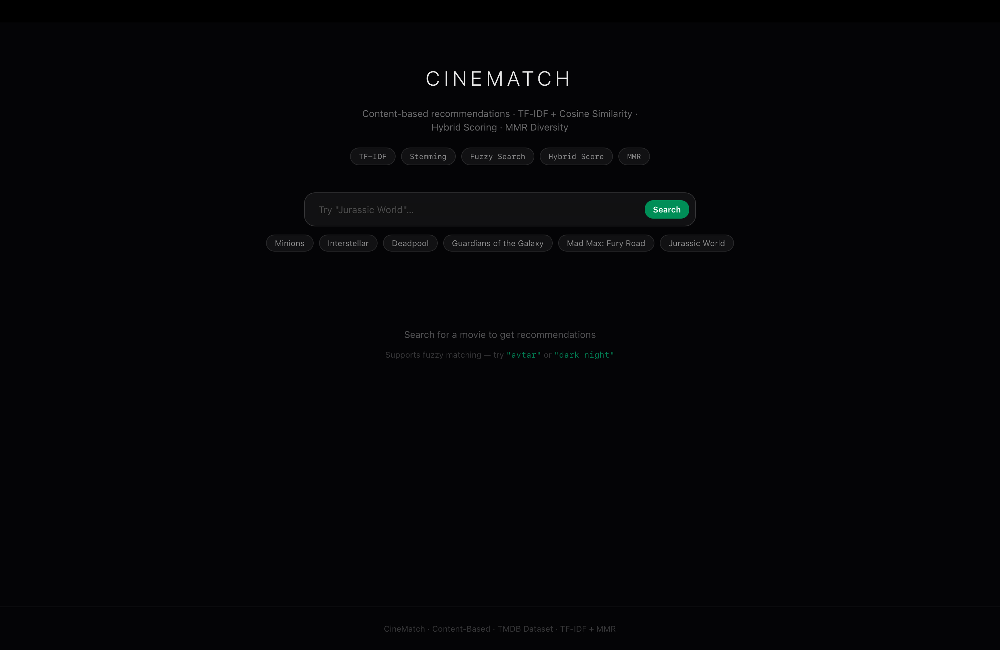
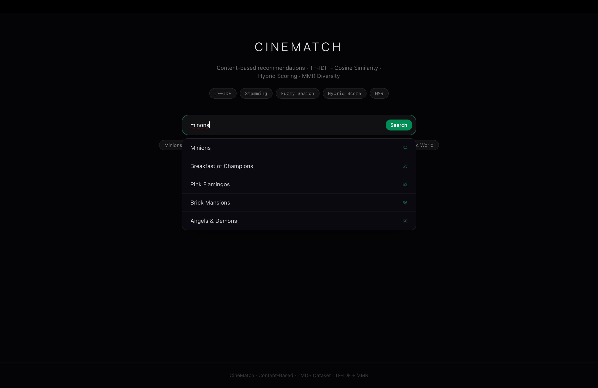
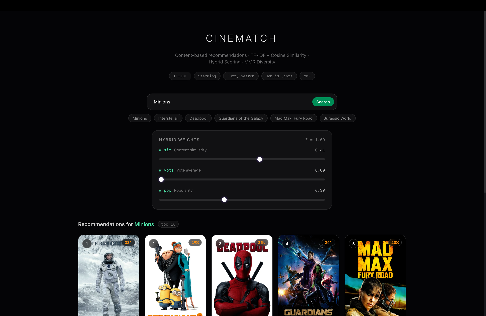
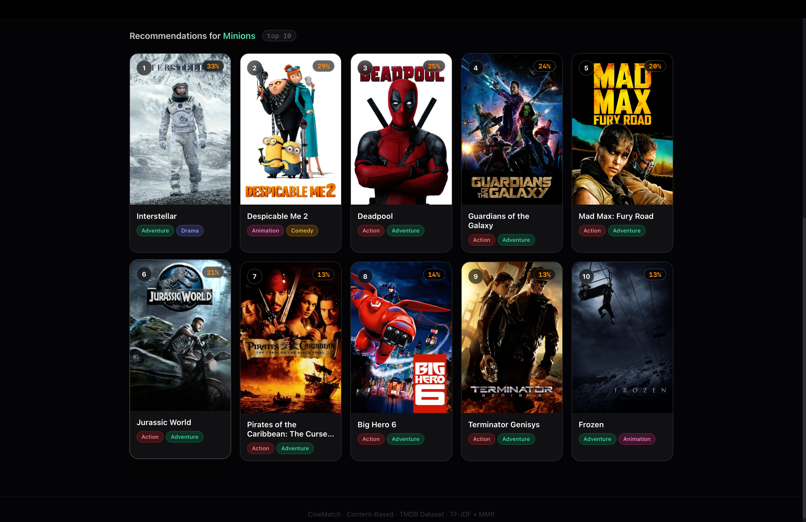

# CineMatch: Movie Recommendation System

A full-stack, content-based movie recommendation system built using the **TMDB dataset**. The system features a powerful machine learning recommendation engine alongside a minimal, high-performance web interface.

---

## Screenshots

<div align="center">
  
  <br/><br/>
  
  <br/><br/>
  
  <br/><br/>
  
</div>

---

## Architecture Overview

CineMatch is divided into three main components:

- **Backend (Django Framework):** Serves the API endpoints for searching and recommendations. Holds a singleton instance of the recommendation engine in-memory for lightning-fast responses.
- **Frontend (Next.js Application):** A beautiful, minimalist web interface built with React and TailwindCSS. Includes instantaneous data caching and a live semantic search autocomplete.
- **Explanation (ML Prototypes & Data):** Contains the original Jupyter Notebooks outlining the data parsing, TF-IDF vectorization, sparse matrix analysis, and TMDB datasets.

---

## Machine Learning Pipeline

The recommendation engine (`backend/src/apps/movies/engine.py`) employs a multi-stage approach to surface relevant content:

1. **TF-IDF Vectorization**: Analyzes movie tags (genres, keywords, cast, and director). Weighs rare, distinctive words higher and applies English stop-word filtering.
2. **Cosine Similarity**: Computes the dot product of L2-normalised TF-IDF vectors to find semantic relationships.
3. **Fuzzy Title Search**: Uses `rapidfuzz` to resolve typos and partial queries gracefully (e.g. `'avtar'` → `Avatar`).
4. **Hybrid Scoring**: Dynamically blends the Semantic TF-IDF Similarity Score with the movie's TMDB Vote Average and Popularity metrics using tunable weights (`w_sim`, `w_vote`, `w_pop`).
5. **MMR Re-ranking**: Employs Maximal Marginal Relevance to balance relevance against catalog diversity, preventing recommendations from being exclusively sequels in the same franchise.
6. **Autocomplete Suggestions**: Leverages the TF-IDF Vectorizer directly against user queries to offer semantic search suggestions before the user even hits enter.

---

## Running the Project Locally

**1. Setup the Backend API**

```bash
cd backend
python3 -m venv .venv
source .venv/bin/activate
pip install -r requirements.txt
python src/manage.py runserver
```

The API will be available at `http://localhost:8000/api/movies/`.

**2. Setup the Frontend Client**

```bash
cd frontend
npm install
npm run dev
```

The Client UI will be available at `http://localhost:3000`.

---

## Repository Structure

```text
movie-recommendation-system/
├── backend/               # Django REST API & ML Engine
├── frontend/              # Next.js UI Application
├── explaination/          # Jupyter notebooks and TMDB datasets
├── README.md              # Project Documentation
└── .gitignore             # Ignored files
```

---

## Contributors

- **Backend Development:** [maulik-0207](https://github.com/maulik-0207) - Developed the Django Python backend and the recommendation engine API.
